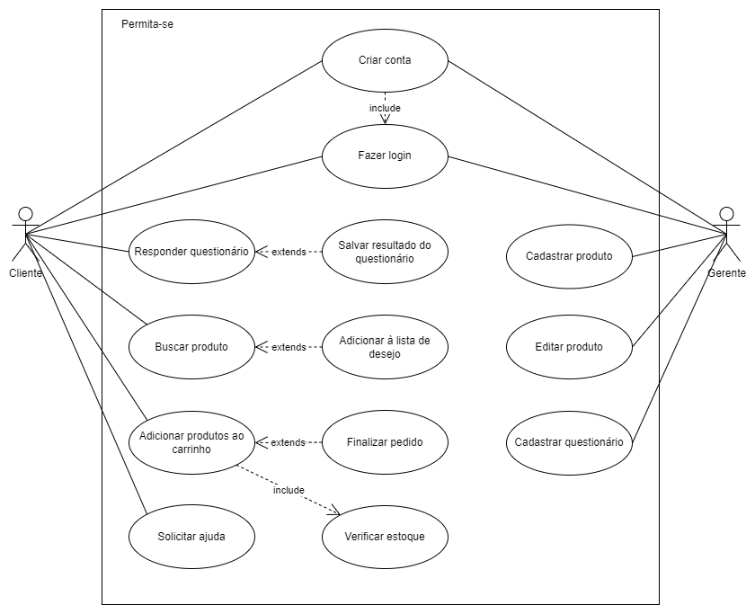

# Especificações do Projeto

A definição do problema e os pontos mais relevantes a serem tratados neste projeto foram consolidados com a participação de clientes da loja **Permita-se** a partir de conversas e entrevistas. Os detalhes levantados nesse processo foram agrupados na forma de personas e histórias de usuários.

## Personas

As personas levantadas durante o processo de entendimento do problema são apresentadas na Figuras que se seguem. 

| **Bianca Souza** |      |      |
|------------------------------|------|------|
| | **Idade:** 40 anos  | **Ocupação:** Terapeuta Holística, Massoterapeuta e proprietaria da loja Permita-se e atua como vendedora. Empreendedora. |
| **Motivações:** Bianca Souza é motivada pela necessidade de aprendizado através de cursos, por trabalhos artesanais e pela família	| **Frustrações:** -- | **Hobbies, História:** Estudar, levar uma vida saudável aos clientes, viajar|

| **Iza Souza** |      |      |
|------------------------------|------|------|
| | **Idade:** 34 anos  | **Ocupação:** Técnica de laboratório, empreendedora e cliente da loja Permita-se  |
| **Motivações:** Iza Souza é movida pelo crescimento profissional e pelo amor aos familares.	| **Frustrações:** -- | **Hobbies, História:** Viajar, leitura e assistir series/filmes|

| **Fernanda Mendes** |      |      |
|------------------------------|------|------|
| | **Idade:** 27 anos  | **Ocupação:** Biomédica, empreendedora e cliente da loja Permita-se |
| **Motivações:** Fernanda encontra motivação no amor a família e pelos estudos.	| **Frustrações:** -- | **Hobbies, História:** passeios com os amigos, viagens.|

## Histórias de Usuários

Com base na análise das personas forma identificadas as seguintes histórias de usuários:
|EU COMO... `PERSONA`| QUERO/PRECISO ... `FUNCIONALIDADE` |PARA ... `MOTIVO/VALOR`                 |
|--------------------|------------------------------------|----------------------------------------|
|Bianca Souza        | Deseja uma plataforma onde consiga postar os seus produtos, com fotos e todas as especificações de cada um. | Para facilitar na divulgação dos seus produtos. |
|Bianca Souza          | Deseja uma plataforma onde consiga filtrar e ordenar seus produtos. | Para direcionar a venda com o produto correto para cada cliente. |
|Bianca Souza     |Deseja uma plataforma onde o cliente consiga criar um cadastro no site  | Para futuramente o cliente receber ofertas via e- mail. |
|Iza Souza      | Deseja um canal de comunicação de fácil acesso com os vendedores da loja através do catálogo de vendas. | Para agilizar o processo de compra e tirar dúvidas caso seja necessário. |
|Iza Souza       | Deseja localizar por categorias todas as informações necessárias para a escolha do seu produto. | Para não se perder entre as páginas e ter agilidade na compra.  |
|Iza Souza        | Deseja deixar como produtos favoritos. | Para finalizar a compra mais tarde. |
|Fernanda Mendes        | Deseja ter acesso a informações sobre o produto de forma clara e acessível.| Para conhecer melhor a marca e os produtos ofertados. |
|Fernanda Mendes     |   Deseja pesquisar o produto por uma barra de busca | Para facilitar a localização do produto desejado. |
|Fernanda Mendes       |Deseja criar um carrinho com os produtos desejados. | Para finalizar a compra com mais rapidez.  |

## Requisitos

As tabelas que se seguem apresentam os requisitos funcionais e não funcionais que detalham o escopo do projeto.

### Requisitos Funcionais

|ID    | Descrição do Requisito  | Prioridade |
|------|-----------------------------------------|----|
|RF-01|A aplicação deve permitir o usuário criar um perfil no site  | Alta | 
|RF-02| A aplicação deve permitir o usuário terá acesso a um Quiz interativo que sugere os melhores produtos baseado nas necessidades em que ele informar    | Alta |
|RF-03| A aplicação deve permitir  o usuário poderá salvar/editar o resultado do Quiz em seu perfil na plataforma (Limite de 5 Quiz Salvos)  | ALTA | 
|RF-04| EmitA aplicação deverá permitir que o usuário utilize as funções buscar/filtrar produtos   |Alta |
|RF-05| A aplicação deve permitir o usuário salvar produtos no perfil (favoritos)  | Média | 
|RF-06| A aplicação deve permitir o usuário encontrar produtos relacionados (listados por categoria)   |Baixa|
|RF-07| A aplicação deve permitir o usuário selecionar os produtos que tem interesse (criar um carrinho)  |Baixa |
|RF-08| A aplicação deve permitir o usuário encaminhar o seu “carrinho de compras” para algum canal de comunicação para a finalização do pedido (Whatsapp, Instagram)  | Alta | 
|RF-09| A aplicação deve permitir entrar em contato com os responsáveis da loja por outros canais (redes sociais) | Alta | 

### Requisitos não Funcionais

|ID     | Descrição do Requisito  |Prioridade |
|-------|-------------------------|----|
|RNF-01| A aplicação deve ser de faço acesso   | Alta | 
|RNF-02|A aplicação deverá ser responsiva permitindo a visualização em um celular de forma adequada.  |  Alta | 
|RNF-03| O site deve ser publicado em um ambiente acessível publicamente na Internet (GitHub)  | Alta | 
|RNF-04|A aplicação deve ter bom nível de contraste entre os elementos da tela e um design simples.  |  Média | 
|RNF-05| A aplicação deve ser protegida contra acesso não autorizado.  | Média | 
|RNF-06| O site deve ser compatível com os principais navegadores da atualidade (Google Chrome, Opera, Firefox, Microsoft Edge).  |  Média | 

Com base nas Histórias de Usuário, enumere os requisitos da sua solução. Classifique esses requisitos em dois grupos:

- [Requisitos Funcionais
 (RF)](https://pt.wikipedia.org/wiki/Requisito_funcional):
 correspondem a uma funcionalidade que deve estar presente na
  plataforma (ex: cadastro de usuário).
- [Requisitos Não Funcionais
  (RNF)](https://pt.wikipedia.org/wiki/Requisito_n%C3%A3o_funcional):
  correspondem a uma característica técnica, seja de usabilidade,
  desempenho, confiabilidade, segurança ou outro (ex: suporte a
  dispositivos iOS e Android).
Lembre-se que cada requisito deve corresponder à uma e somente uma
característica alvo da sua solução. Além disso, certifique-se de que
todos os aspectos capturados nas Histórias de Usuário foram cobertos.

## Restrições

O projeto está restrito pelos itens apresentados na tabela a seguir.

|ID| Restrição                                             |
|--|-------------------------------------------------------|
|01| O projeto deverá ser entregue até o final do semestre |
|02| Não pode ser desenvolvido um módulo de backend        |

Enumere as restrições à sua solução. Lembre-se de que as restrições geralmente limitam a solução candidata.

> **Links Úteis**:
> - [O que são Requisitos Funcionais e Requisitos Não Funcionais?](https://codificar.com.br/requisitos-funcionais-nao-funcionais/)
> - [O que são requisitos funcionais e requisitos não funcionais?](https://analisederequisitos.com.br/requisitos-funcionais-e-requisitos-nao-funcionais-o-que-sao/)

## Diagrama de Casos de Uso

O objetivo do diagrama de caso de uso em UML é demonstrar as diferentes maneiras que um usuário pode interagir com o sistema. Para o nosso caso, teremos apenas dois usuários: Cliente e Gerente, e no diagrama abaixo, podemos visualizar as funcionalidades acessadas por cada um.

