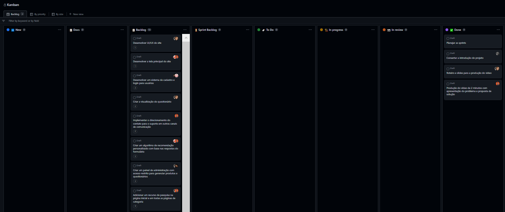

# Metodologia

A metodologia contempla as definições de ferramentas utilizadas pela equipe tanto para a manutenção dos códigos e demais artefatos quanto para a organização do time na execução das tarefas do projeto.

## Controle de Versão

A ferramenta de controle de versão adotada no projeto foi o
[Git](https://git-scm.com/), sendo que o [Github](https://github.com)
foi utilizado para hospedagem do repositório.

O projeto segue a seguinte convenção para o nome de branches:

- `master`: versão estável já testada do software
- `dev`: versão de desenvolvimento do software
- `feature`: versão de nova funcionalidade

Quanto à gerência de issues, o projeto adota a seguinte convenção para
etiquetas:

- `doc`: melhorias ou acréscimos à documentação
- `bug`: uma funcionalidade encontra-se com problemas
- `test`: uma funcionalidade precisa ser testada
- `feature`: uma nova funcionalidade precisa ser introduzida

## Gerenciamento de Projeto

A equipe utiliza metodologias ágeis, tendo escolhido o Kanban como base para definição do processo de desenvolvimento.

### Divisão de Papéis

A equipe está organizada da seguinte maneira:

- **Product Manager:** Gabriel Augusto
- **Equipe de Desenvolvimento:**
  - Lucas Marcelo
  - Nayra Alessandra
- **Equipe de UI/UX:**
  - Pricilla Baier
  - Roberta Gomes

### Processo

Para organização e distribuição das tarefas do projeto, a equipe está utilizando o Projects do GitHub com um Kanban. Ele está composto com as seguintes listas:

- **🆕New:** Recebe as tarefas novas que não tem uma definição ainda. Todas as atividades identificadas no decorrer do projeto também devem ser incorporadas primeiramente nessa lista.
- **📋 Docs:** Recebe as tarefas referentes a melhorias na documentação do projeto.
- **📋 Backlog:** Representa o Product Backlog. 
- **⌛ Sprint Backlog:**  Recebe as tarefas a serem trabalhadas na sprint atual.
- **🔖 To Do:** Esta lista representa todas as tarefas que não foram iniciadas ainda.
- **🏗 In progress:** Quando uma tarefa tiver sido iniciada, ela é movida para cá.
- **👀 In review:** Quando a codificação de uma tarefa tiver sido finalizada, a tarefa é movida para cá onde é feito o controle de qualidade do código.
- **✅ Done:** Nesta lista são colocadas as tarefas que passaram pelos testes e controle de qualidade e estão prontas para o deploy, ou seja, lista de tarefas completadas.

O quadro completo pode ser visualizado através do link [aqui](https://github.com/orgs/ICEI-PUC-Minas-PMV-ADS/projects/251/views/1) e é representado no estado atual na figura a seguir.

### Ferramentas

As ferramentas empregadas no projeto são:

- **Editor de código:** Visual Studio.
- **Ferramentas de comunicação:** Whatsapp, Teams.
- **Ferramentas de desenho de tela (wireframing):** [Canva](https://www.canva.com/)
- **Ferramentas para diagramas (conceitual e lógico):** [Diagrams.net](https://app.diagrams.net/)

O editor de código foi escolhido pelo grupo pois é o mais prático e acessível para os integrantes. Tem um bom dicionário de erros no código e permite acompanhar alterações em tempo real através do navegador. As ferramentas de comunicação utilizadas são as mais práticas e por isso foram selecionadas. Por fim, para criar diagramas utilizamos o Draw.io, pois o time já tinha experiência com ele.

