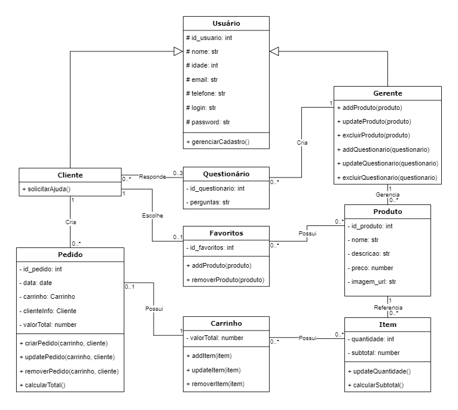
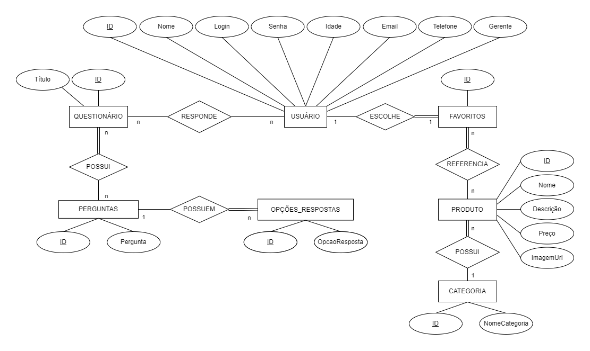
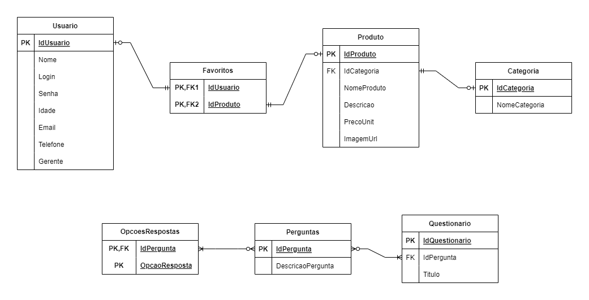

# Arquitetura da Solução

Definição de como o software é estruturado em termos dos componentes que fazem parte da solução e do ambiente de hospedagem da aplicação.

## Diagrama de Classes

O diagrama de classes ilustra graficamente como será a estrutura do software, e como cada uma das classes da sua estrutura estarão interligadas. Essas classes servem de modelo para materializar os objetos que executarão na memória. Inicialmente o projeto contará com 9 classes - Usuário, Gerente, Cliente, Questionário, Favoritos, Pedido, Carrinho, Item e Produto - Seus atributos, métodos e suas ligações são representadas no diagrama.

## Modelo ER (Projeto Conceitual)

O nosso modelo ER demonstra a relação entre as entidades na nossa aplicação interativa.
Para construir o diagrama foi usado como ferramenta o site diagrams.net (https://app.diagrams.net/).

## Projeto da Base de Dados

No projeto de base de dados, as entidades e relacionamentos identificados no Modelo ER foram representados no formato de tabelas, com colunas e as chaves primárias/estrangeiras que representam as restrições de integridade.

## Tecnologias Utilizadas

Será utilizado o Visual Studio e para o Banco de Dados o SQL Server. Linguagem utilizada será C#, Framework React e IDEs Visual Studio.

## Hospedagem

Explique como a hospedagem e o lançamento da plataforma foi feita.

> **Links Úteis**:
>
> - [Website com GitHub Pages](https://pages.github.com/)
> - [Programação colaborativa com Repl.it](https://repl.it/)
> - [Getting Started with Heroku](https://devcenter.heroku.com/start)
> - [Publicando Seu Site No Heroku](http://pythonclub.com.br/publicando-seu-hello-world-no-heroku.html)
