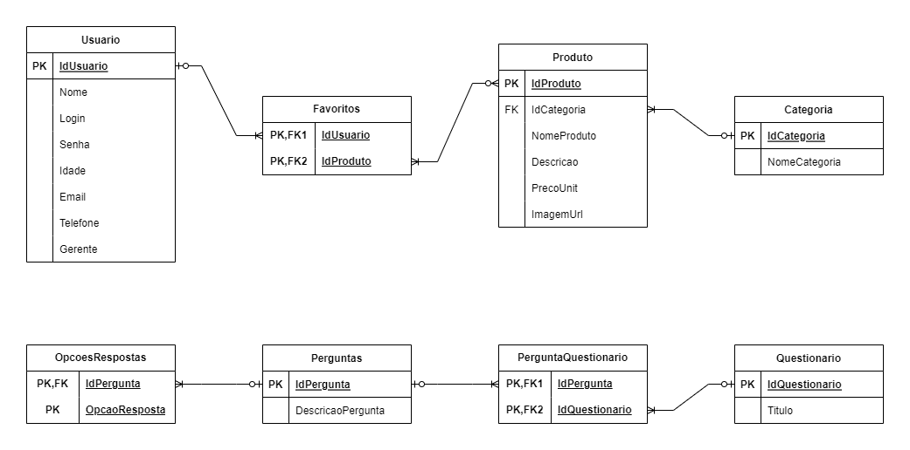

# Arquitetura da Solução

Definição de como o software é estruturado em termos dos componentes que fazem parte da solução e do ambiente de hospedagem da aplicação.

## Diagrama de Classes

O diagrama de classes ilustra graficamente como será a estrutura do software, e como cada uma das classes da sua estrutura estarão interligadas. Essas classes servem de modelo para materializar os objetos que executarão na memória. Inicialmente o projeto contará com 9 classes - Usuário, Gerente, Cliente, Questionário, Favoritos, Pedido, Carrinho, Item e Produto - Seus atributos, métodos e suas ligações são representadas no diagrama.

## Modelo ER (Projeto Conceitual)

O nosso modelo ER demonstra a relação entre as entidades na nossa aplicação interativa. No modelo usamos como base as estruturas de classe do diagrama de classe e seus atributos para construir as entidades. Mapeando as funcionabilidades foram então levantado os relacionamentos entre as entidades.

## Projeto da Base de Dados

No projeto de base de dados, as entidades e relacionamentos identificados no Modelo ER foram representados no formato de tabelas, com colunas e as chaves primárias/estrangeiras que representam as restrições de integridade.

## Tecnologias Utilizadas

IDE Visual Studio, linguagem de programação C#, Frameworks .NET e SQL Server para Banco de Dados.
